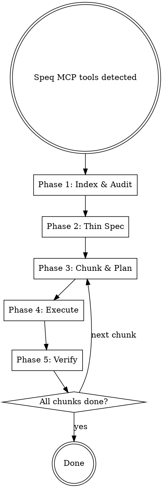

# Speq-Driven Development

## Overview

Build software from a speq by treating it as the **external source of truth** throughout planning and execution. Never copy speq content into internal docs — reference by ID and fetch on demand. Every spec section, plan task, and verification step traces back to speq requirement and screen IDs.

**Announce at start:** "Speq MCP tools detected. Using speq-driven-development to ensure full requirement traceability."

## When to Use

**Auto-activate when:** Speq MCP tools are available in the environment (`list_requirements`, `list_screens`, `get_phase`, etc.) AND the user asks to build, implement, or plan work.

**Do not use when:** The user is only querying the speq for information, not building from it.

## Red Flags — STOP

| Thought | Reality |
|---------|---------|
| "I'll read the speq once and work from memory" | Speq is external store. Fetch on demand, every time. |
| "I'll copy all requirements into the spec" | Thin references only. IDs + decisions, not restatements. |
| "This speq is small, I can inline everything" | Same process regardless of size. Consistency matters. |
| "I know what that requirement means" | Call `get_requirement`. Your assumption may be wrong. |
| "I'll verify at the end" | Verify per chunk. Gaps compound. |
| "The plan covers this implicitly" | Every plan task must map to explicit speq IDs. No implicit coverage. |
| "I'll create the manifest after writing the plans" | Manifest comes FIRST. It's the plan for the plans, not a summary. |
| "WebSockets/logging/JSDoc can wait" | Tech standards are requirements too. Verify them in code, not just in the plan. |

## Process



---

## Phase 1: Index & Audit

**Goal:** Build a lightweight skeleton of all requirements without filling context. Do NOT fetch full details.

**Steps:**

1. `get_speq_overview` — scope, phases, status
2. `list_screens` — screen IDs and names only
3. `list_requirements` per screen — requirement IDs and one-line descriptions
4. `get_phase_summary` for each completed phase — condensed summaries (~2200 chars each)

**Self-audit:** Walk each phase summary. For every capability or behavior mentioned, confirm a requirement ID exists that covers it. If a phase summary describes something with no matching requirement, flag it as a gap and note it for the spec.

**Output:** Present the user with:
- Total requirement count and groups
- Screen list with IDs
- Any gaps found during self-audit
- Proposed chunking (see Phase 3)

**Do NOT proceed until the user confirms the index is complete.**

---

## Phase 2: Thin Spec

**REQUIRED SUB-SKILL:** Use superpowers:brainstorming for the design process.

The spec captures **decisions and architecture**, not requirement restatements. Every section references speq IDs.

**Spec structure:**

```markdown
# [Feature] Design Spec

**Speq:** [speq title from overview]
**Screens:** screen_id_1, screen_id_2, ...
**Requirement groups:** group_id_1 (N reqs), group_id_2 (N reqs), ...

## Architecture Decisions

[Decisions that the speq doesn't prescribe — tech choices, patterns, tradeoffs]

## Requirement Group: [group_name]

**Covers:** req_group_x_01 through req_group_x_NN
**Screens:** screen_id_1, screen_id_2

[Architecture and implementation decisions for this group.
Do NOT restate what the requirements say.
DO note anything the speq leaves ambiguous and the decision you made.]

## Traceability Matrix

| Speq Requirement | Spec Section | Plan Chunk | Notes |
|-----------------|--------------|------------|-------|
| req_group_x_01  | Section 2    | chunk-1    |       |
| req_group_x_02  | Section 2    | chunk-1    |       |
| ...             |              |            |       |

## Data Model Decisions

[Reference speq tech phase model IDs. Note any fields/models you're adding
or where the speq is ambiguous. Call `get_phase("tech")` to verify field lists.]
```

**Critical rule:** Before finalizing the spec, call `get_phase("tech")` and verify every data model field in the speq is accounted for. The most common miss is fields mentioned in the speq but absent from the schema (e.g., `priority` on Task).

**Save to:** `docs/speq/specs/YYYY-MM-DD-<feature>.md`

---

## Phase 3: Chunk & Plan

**REQUIRED SUB-SKILL:** Use superpowers:writing-plans for each chunk.

### Step 1: Create the Manifest FIRST

**The manifest is the plan for the plans.** Create it BEFORE writing any chunk plans. Do NOT write chunk plans in parallel and then summarize them into a manifest after — that inverts the process.

1. Define chunks based on requirement groups
2. Write the manifest with chunk names, speq group mappings, requirement counts, and dependencies
3. **Present the manifest to the user for confirmation**
4. Only after confirmation, write the individual chunk plans

**Save to:** `docs/speq/manifest.md`

### Chunking Rules

Split by **requirement group** from the speq. Each chunk should contain **3-5 plan tasks** (completable in one subagent session).

If a requirement group would produce more than 5 tasks, split it into sub-chunks by screen or by layer (data → API → frontend). A group of 11 requirements (e.g., workspace settings with Todoist import) should be split into at least 2 chunks.

```markdown
# Implementation Manifest

**Speq:** [title]
**Spec:** docs/speq/specs/YYYY-MM-DD-<feature>.md
**Total requirements:** N

| # | Plan File | Speq Groups | Reqs | Status | Depends On |
|---|-----------|-------------|------|--------|------------|
| 1 | chunk-auth.md | group_authentication | 5 | pending | — |
| 2 | chunk-onboarding.md | group_onboarding | 4 | pending | 1 |
| ... | | | | | |
```

### Plan Task Format

Every task in the plan MUST include a `Speq refs` line:

````markdown
### Task N: [Component Name]

**Speq refs:** req_group_x_01, req_group_x_02, screen_y
**Files:** ...

- [ ] Step 1: ...
````

**Before finalizing each chunk plan**, fetch full details for every referenced requirement:
- `get_requirement(requirementId)` for each req in the chunk
- `get_screen(screenId)` for each screen in the chunk
- Verify the plan tasks actually satisfy what the requirement says, not just what you remember

### No Orphans Rule

After all chunk plans are written:
1. Walk the traceability matrix from the spec
2. Every speq requirement MUST appear in at least one plan task's `Speq refs`
3. Every plan task MUST reference at least one speq requirement
4. If orphans exist, fix them before execution

---

## Phase 4: Execute

**REQUIRED SUB-SKILL:** Use superpowers:subagent-driven-development (recommended) or superpowers:executing-plans.

### Subagent Context

Each subagent receives:
1. The current chunk plan
2. Instruction to use speq MCP tools for requirement details (NOT the full speq)
3. The manifest (for awareness of what's been built)

### Subagent Speq Fetching

Subagents MUST call speq MCP tools to fetch full requirement/screen details before implementing. They should NOT rely on the plan's summary alone.

```
Before implementing Task N:
1. Read the task's Speq refs
2. Call get_requirement() for each referenced requirement
3. Call get_screen() for each referenced screen
4. Implement against the fetched details
```

### Progress Tracking

Update the manifest after each completed task. If a session ends mid-chunk, the next session reads the manifest and resumes from the last completed task.

---

## Phase 5: Verify

After each chunk is executed, verify against the speq.

**Steps:**

1. For each requirement in the chunk, call `get_requirement(id)` to get the full description
2. Check the implementation against the requirement (read relevant files, run the app if possible)
3. Mark each requirement as MET, PARTIALLY MET, or NOT MET
4. Fix any PARTIALLY MET or NOT MET before updating the manifest to "done"

**Common product gaps to check explicitly:**
- Confirmation dialogs for destructive actions (delete, import)
- Form validation for required fields
- Empty states for lists and containers
- Logout/sign-out functionality
- Error states and loading states
- All data model fields from speq tech phase are in the schema
- All API endpoints from speq tech phase exist

**Tech standards to verify explicitly** (these are commonly skipped even when specified):
- WebSocket/real-time sync implementation (not just the library — actual event handling)
- Structured logging (not just console.log — a logging library with context)
- JSDoc comments on all exported functions
- Frontend AND backend test coverage
- Accessibility: semantic HTML, keyboard navigation, ARIA labels, form labels, contrast

**After ALL chunks are complete**, run a final full audit:
1. `list_requirements` — walk every requirement
2. `list_screens` — verify every screen exists in the UI
3. `get_phase("tech")` — fetch FULL tech phase (not summary) and verify each implementation standard
4. For each tech standard, grep the codebase to confirm it exists in code, not just in the plan
5. Report final coverage to user with MET/PARTIAL/NOT MET for every requirement AND tech standard

---

## Artifact Locations

```
docs/speq/
  manifest.md                           # Chunk tracking and status
  specs/
    YYYY-MM-DD-<feature>.md             # Thin spec with speq ID references
  plans/
    YYYY-MM-DD-<feature>-chunk-N.md     # One plan per chunk
```

## Key Principles

- **Speq is the source of truth.** Internal docs reference it; they don't replace it.
- **Fetch on demand.** Never front-load all speq content into context.
- **Every artifact traces to speq IDs.** Spec sections, plan tasks, and verification results all reference requirement and screen IDs.
- **Verify per chunk, not just at the end.** Gaps compound. Catch them early.
- **No orphan requirements.** If a speq requirement has no plan task, the plan is incomplete.
- **No orphan tasks.** If a plan task has no speq requirement, it shouldn't exist.
